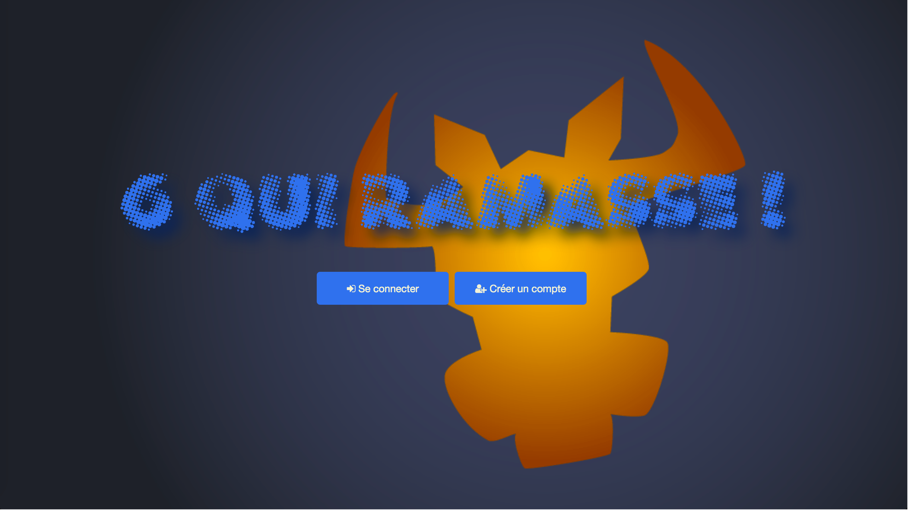
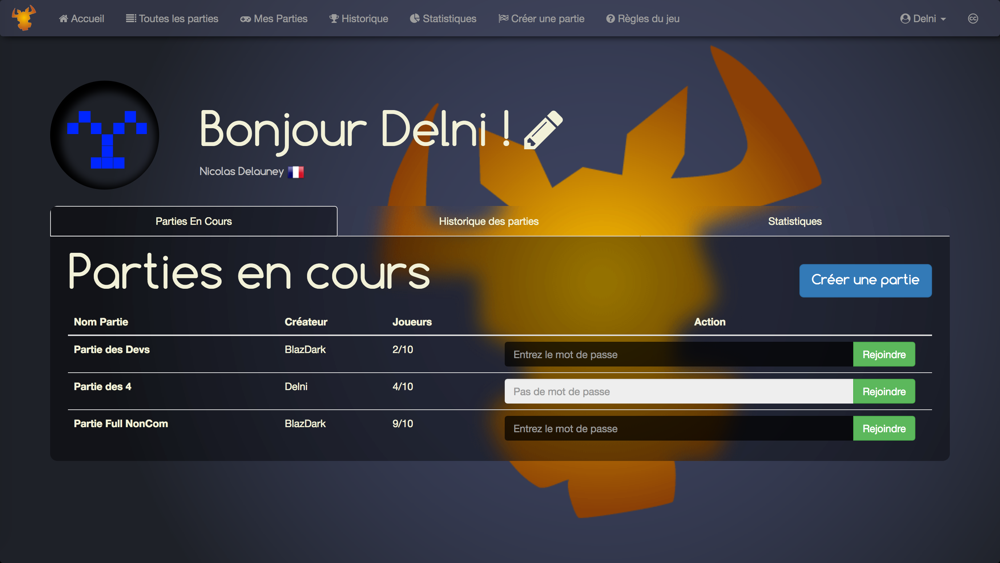
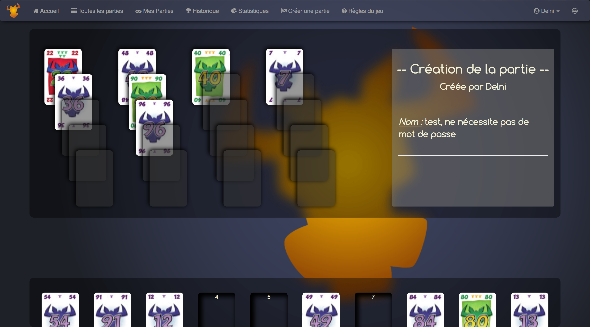

# 6 Qui ramasse


## Le projet
La majeure ISIC (Ingénierie des Systèmes d'Information et de Communication) de l'école des Mines de Douai demande à chaque promotion de réaliser un projet web de bout en bout.

Le sujet de la promotion 2018 fut de recréer le jeu de carte __6nimmt!__ ([wiki](https://fr.wikipedia.org/wiki/6_qui_prend_!)), permettant des parties de 2 à 10 joueurs, et le présent projet est celui réalisé par N. Delauney et A. Handjani

## Spécificité du Project
Le projet repose sur un framework PHP dit [MVC](https://en.wikipedia.org/wiki/Model%E2%80%93view%E2%80%93controller) qui a été codé *from Scratch*, nous permettant d'apréhender au mieux les subtilités du langage PHP et de comprendre en profondeur la structure MVC.


## Previews


Dashboard principal


Une partie en cours

## How-to
Le site n'est malheureusement pas hébergé en ligne. Pour pouvoir tester le site, il vous faut un serveur local (WAMP, MAMP, UAMP,...).

Ouvrez un terminal :

```bash
# Clone the repository
$ git clone https://github.com/Delni/webproject.git
```

Il faut ensuite initialiser la base de donnée MySQL en chargeant le fichier `./sql/fullSetUp.sql` dans votre base de données

Au besoin, adapter `./classes/DatabasePDO.class.php` pour correspondre aux paramètres de connection de la base de données :

```php
   <?php
    // DatabasePDO.class.php
    // ...
18  protected static $user = 'root';
19  protected static $pass = 'root';
    // ...
    ?>
```

## Liens externes

* [Font Awesome ](http://fontawesome.io/)
* [Bootstrap](https://getbootstrap.com)
* [HTML5](https://www.w3schools.com/html/default.asp)
* [CSS3](https://www.w3schools.com/css/default.asp)
* [PHP7](https://www.w3schools.com/php/default.asp)
